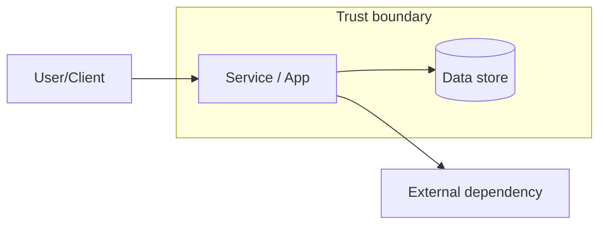
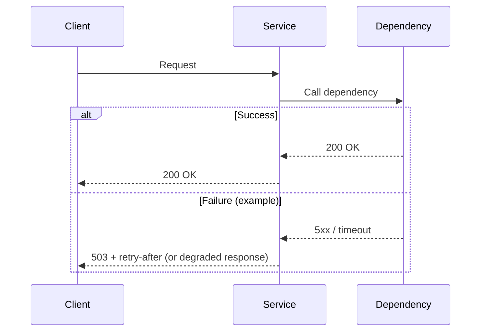

# Infrastructure Design Doc

## Summary

<BLUF: what is being built/changed and the intended outcome>

## Problem

- Current state:
- Pain/risks:
- Why now:

## Goals And Non-Goals

- Goals:
- Non-goals:

## Requirements

- Functional:
- Non-functional (SLOs, RTO/RPO, compliance):

## Current Architecture

<Short description. Link to diagrams if they exist.>

## Diagrams

### System Diagram

### Flow Diagram

## Proposed Design

- Components:
- Data flow:
- Dependency map:

## Options Considered

1. Option A:
2. Option B:

## Trade-offs

- Reliability:
- Security:
- Operational complexity:
- Cost:

## Rollout Plan

- Stages:
- Verification:
- Rollback criteria:
- Rollback steps:

## Observability

- SLIs and dashboards:
- Alerts:
- Runbooks:

## Security

- IAM:
- Network boundaries:
- Secrets:
- Audit:

## Open Questions

-
